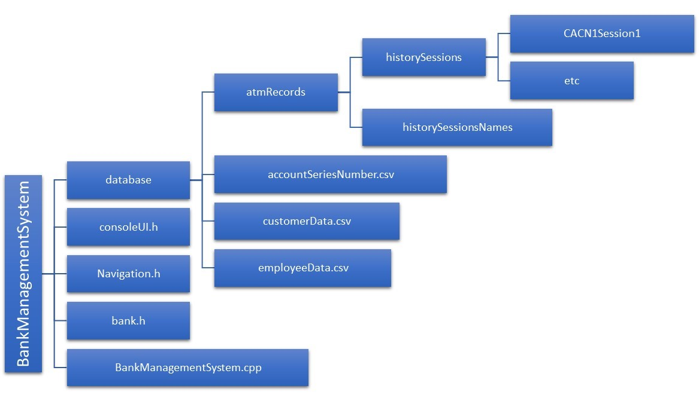

# BankManagementSystem
A simple Bank Management System programmed entirely in C++ programming language. It includes features like: add record, remove a record, modify/update a record, search records (either by Account ID or Account User Name’s first letter), view transaction history of atm machine and so on.

It is recommended to run this project on Visual Studio 2019

